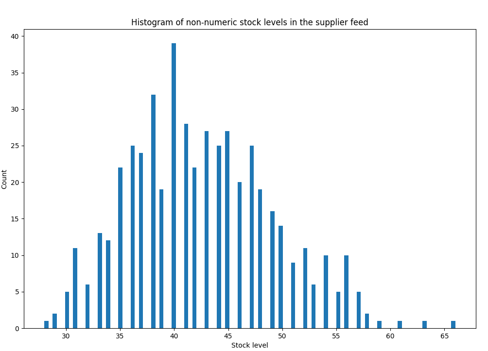
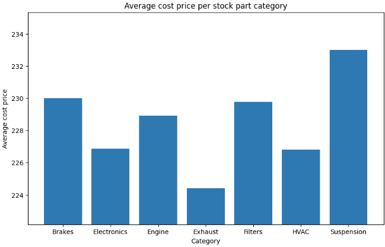
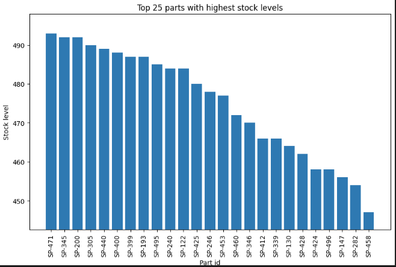
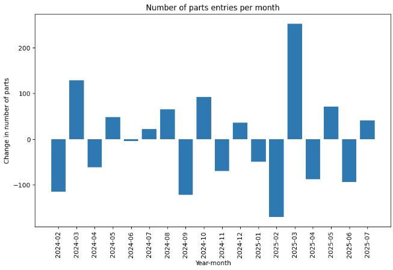

# Project: Supplier Data Integration & Analysis Pipeline

Welcome to my submission for the Supplier Data Integration & Analysis Pipeline task!

## Installation

## Data Cleaning Strategies

For the supplier feed, I first checked for missing values. Stock level and cost price had missing values. For the missing stock levels, I figured it's best to say the parts are unavailable until we can figure the stock levels, because it could be troublesome if a customer placed an order for a part that turns out is unavailable. As for the missing cost prices (NaNs), I replaced them by the average of the cost prices for the given stock over time. I figured this would be an accurate representation of the stock price given the historic data.

The data had to be cleaned thoroughly. Firstly, the entry dates had to be standardized to be of a uniform format. Stock levels also had to be standardized. Some of them were non-numeric, which were mapped to either 0 (for unavailable stocks), or to 30 (for low stocks). The number 30 was determined through an analysis of the lowest stock level counts in the supplier feed data. The cost prices also had to be standardized. Aside from the missing stock prices, some of the stock prices contained a dollar sign, which had to be stripped.

`sqlite3` was used to create the database tables and to import the data. The `supplier_feed` table has an integer id primary key for each row which is autoincremented, `part_id` as string, `stock_level` as integer, `cost_price` as a float, and `entry_date` as a date. The `product_metadata` table has the `part_id` as the primary key, `part_name` as string, and `category` as string.

For the analysis part, I found that the average cost price per category is pretty uniform (all in the range 224-233). The top 5 parts with highest stock levels also have similar stock levels (in the range 489-493). Finally, there wasn't a clear trend in the number of new parts entries over time on a monthly basis. From month to month, it tended to shoot up and down with varying magnitudes. Refer to the Figures section for the figures.

## Assumptions

Here are some assumptions I made for this task:

Task 1.

- The `cost_price` column only has three different types of values: a number, NaN, or a string with a dollar sign in front of a number

- The dates that are of the form `03/04/24` are `mm/dd/yy` (month first)

Task 2.

- Assuming `product_metadata.csv` does not require processing/cleaning

- Assuming `part_id` can be used as a primary key for the `product_metadata` table (i.e. only a single row per `part_id` are present)

- Assuming `part_name` and `category` are not null

Task 3.

- Assuming `category` names are uniform. For example, a filter part will always have a category of `Filters` and not `Filter`

## Figures

Histogram of non-numeric stock levels in the supplier feed

Average cost price per stock part category

Top 25 parts with highest stock levels

Number of parts entries per month

